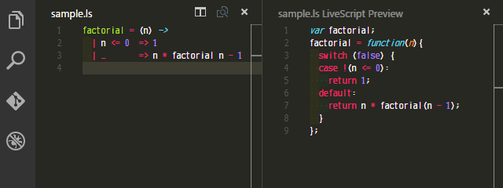

# LiveScript Preview
LiveScript previewer for Visual Studio Code.  
Inspired by [CoffeeScript Preview](https://github.com/dcbarrett/vscode-coffeescript-preview).

[![GitHub license][license-img]][license-url]

## Features

* Preview compilation of LiveScript code
* Live update
* Preview selection of code

## Usage

1. Open or create a LiveScript source file
1. Press `Ctrl(Cmd)+Shift+/` or Execute from command palette (See below)
  1. Press `F1` or `Ctrl(Cmd)+Shift+P`
  1. Type `lp`
  1. pick `LiveScript Preview`

[license-img]: https://img.shields.io/badge/license-MIT-blue.svg
[license-url]: https://raw.githubusercontent.com/eheitherd/vscode-livescript-preview/master/LICENSE
